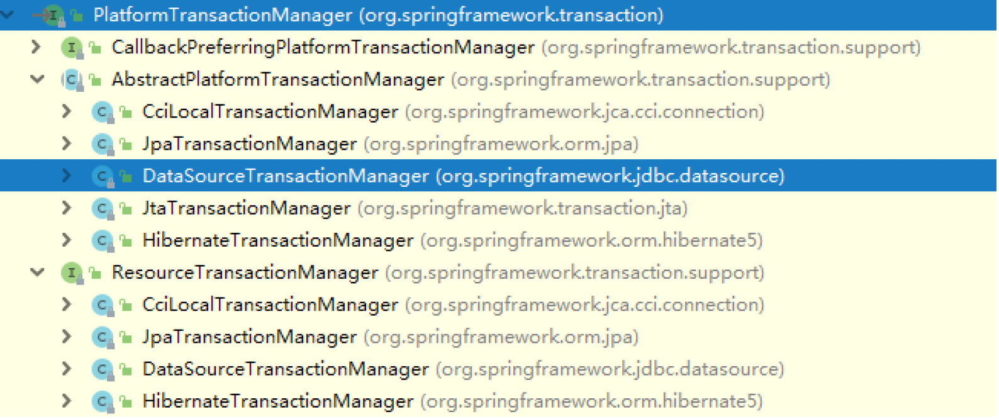
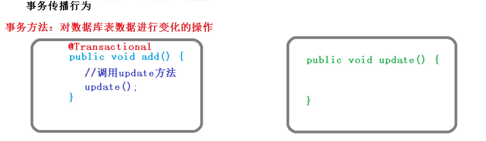
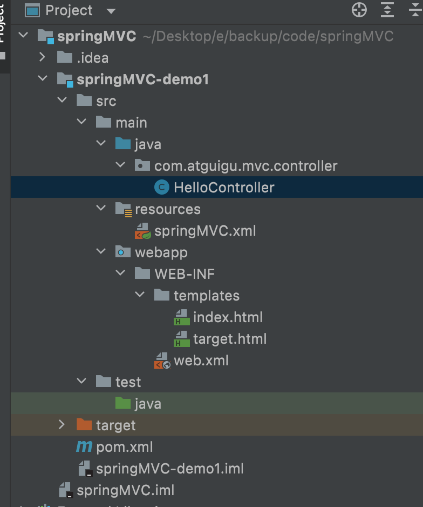
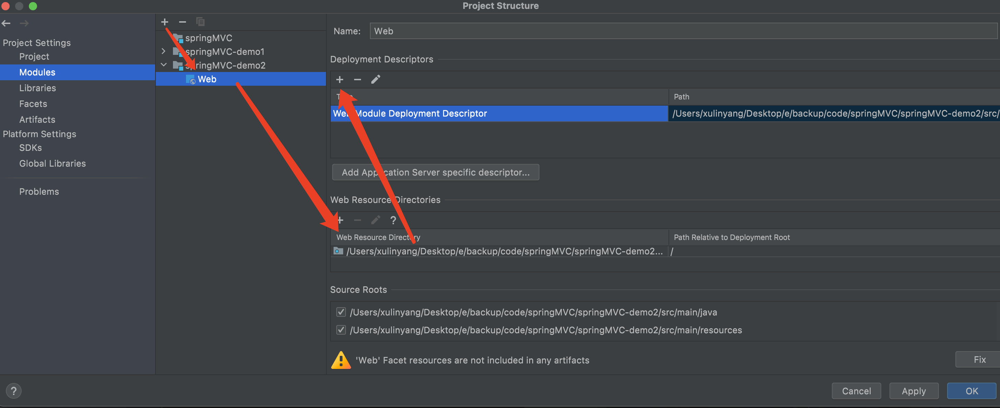
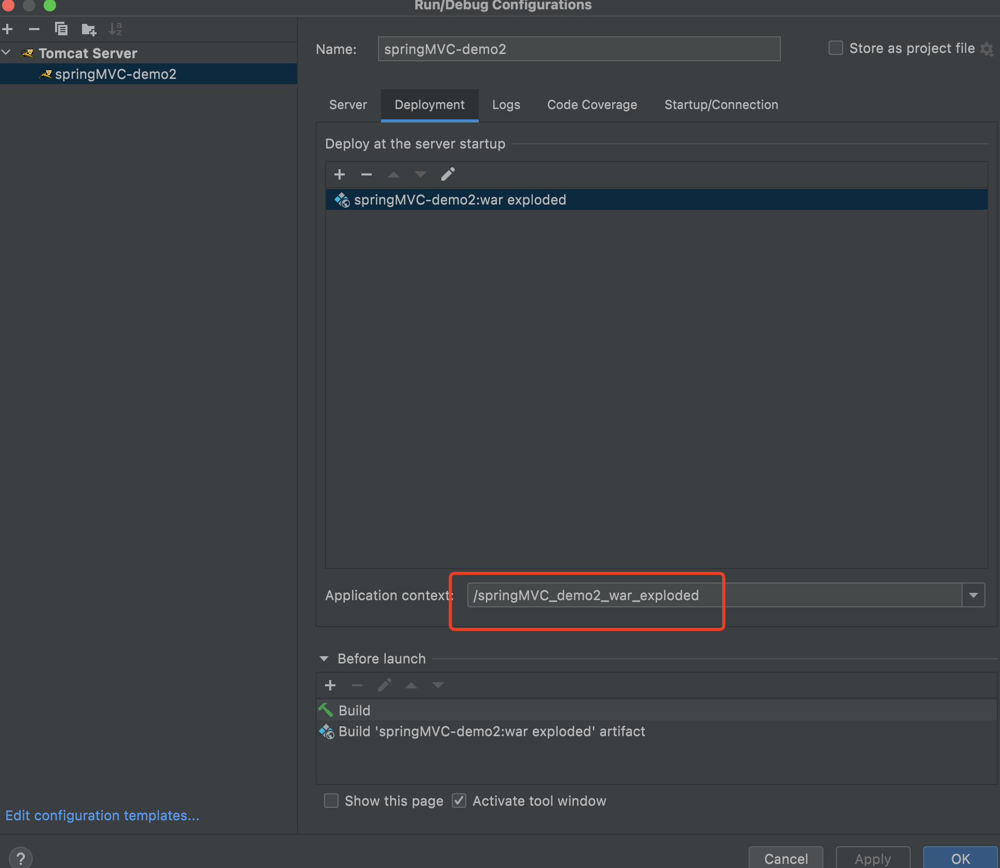
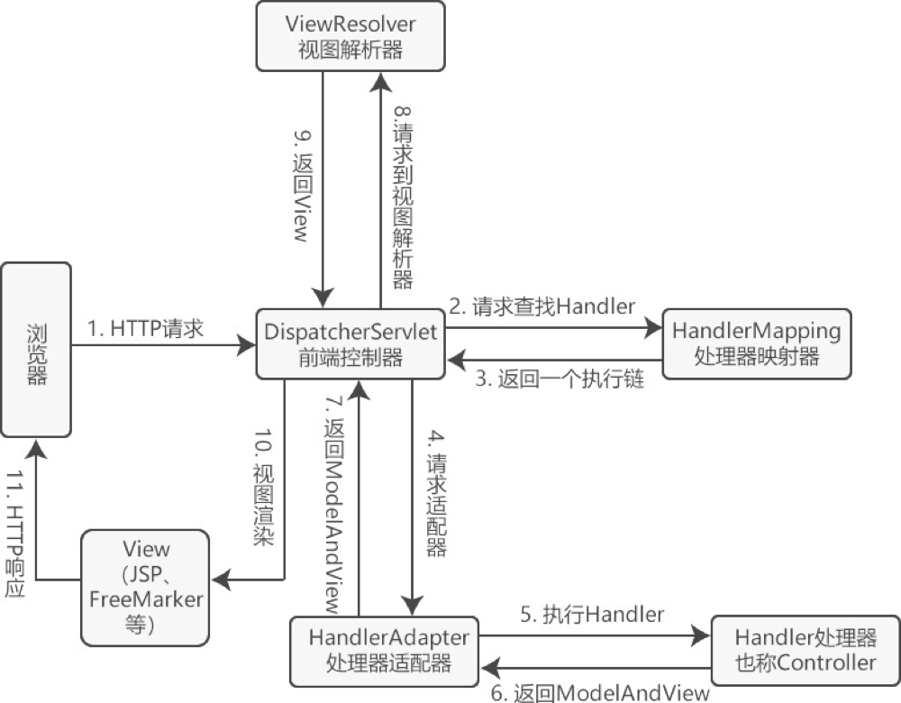

# learn-spring
<!-- TOC -->

- [learn-spring](#learn-spring)
    - [resource:](#resource)
        - [book](#book)
        - [video](#video)
    - [spring](#spring)
        - [spring IOC](#spring-ioc)
        - [spring AOP](#spring-aop)
        - [spring jdbc](#spring-jdbc)
            - [0 配置数据库连接](#0-%E9%85%8D%E7%BD%AE%E6%95%B0%E6%8D%AE%E5%BA%93%E8%BF%9E%E6%8E%A5)
            - [1 表示database数据的class](#1-%E8%A1%A8%E7%A4%BAdatabase%E6%95%B0%E6%8D%AE%E7%9A%84class)
            - [2 Dao 增删改查](#2-dao-%E5%A2%9E%E5%88%A0%E6%94%B9%E6%9F%A5)
                - [2a 赠](#2a-%E8%B5%A0)
                    - [一次添加单个mysql记录: jdbcTemplate.update](#%E4%B8%80%E6%AC%A1%E6%B7%BB%E5%8A%A0%E5%8D%95%E4%B8%AAmysql%E8%AE%B0%E5%BD%95-jdbctemplateupdate)
                    - [一次添加多个mysql记录: jdbcTemplate.batchUpdate](#%E4%B8%80%E6%AC%A1%E6%B7%BB%E5%8A%A0%E5%A4%9A%E4%B8%AAmysql%E8%AE%B0%E5%BD%95-jdbctemplatebatchupdate)
                - [2b 改](#2b-%E6%94%B9)
                    - [一次修改单个mysql记录: jdbcTemplate.update](#%E4%B8%80%E6%AC%A1%E4%BF%AE%E6%94%B9%E5%8D%95%E4%B8%AAmysql%E8%AE%B0%E5%BD%95-jdbctemplateupdate)
                - [2c 删](#2c-%E5%88%A0)
                    - [一次删除单个mysql记录: jdbcTemplate.update](#%E4%B8%80%E6%AC%A1%E5%88%A0%E9%99%A4%E5%8D%95%E4%B8%AAmysql%E8%AE%B0%E5%BD%95-jdbctemplateupdate)
                - [2d 查](#2d-%E6%9F%A5)
                    - [query并返回primitive: jdbcTemplate.queryForObject](#query%E5%B9%B6%E8%BF%94%E5%9B%9Eprimitive-jdbctemplatequeryforobject)
                    - [query并返回对象: jdbcTemplate.queryForObject](#query%E5%B9%B6%E8%BF%94%E5%9B%9E%E5%AF%B9%E8%B1%A1-jdbctemplatequeryforobject)
                    - [query并返回collection: jdbcTemplate.query](#query%E5%B9%B6%E8%BF%94%E5%9B%9Ecollection-jdbctemplatequery)
            - [3 Service使用Dao](#3-service%E4%BD%BF%E7%94%A8dao)
            - [4 使用](#4-%E4%BD%BF%E7%94%A8)
        - [spring transaction](#spring-transaction)
            - [0 配置数据库连接](#0-%E9%85%8D%E7%BD%AE%E6%95%B0%E6%8D%AE%E5%BA%93%E8%BF%9E%E6%8E%A5)
                - [xml](#xml)
                - [annotation](#annotation)
            - [3 Service中的methods配置事物@Transactional](#3-service%E4%B8%AD%E7%9A%84methods%E9%85%8D%E7%BD%AE%E4%BA%8B%E7%89%A9transactional)
            - [4 使用](#4-%E4%BD%BF%E7%94%A8)
                - [xml](#xml)
                - [annotation](#annotation)
    - [spring mvc](#spring-mvc)
        - [hello spring mvc](#hello-spring-mvc)
        - [@RequestedMapping](#requestedmapping)
            - [1 @RequestedMapping注解修饰的位置 class, method](#1-requestedmapping%E6%B3%A8%E8%A7%A3%E4%BF%AE%E9%A5%B0%E7%9A%84%E4%BD%8D%E7%BD%AE-class-method)
            - [2 @RequestedMapping注解的value属性](#2-requestedmapping%E6%B3%A8%E8%A7%A3%E7%9A%84value%E5%B1%9E%E6%80%A7)
            - [3 @RequestedMapping注解的method属性](#3-requestedmapping%E6%B3%A8%E8%A7%A3%E7%9A%84method%E5%B1%9E%E6%80%A7)
            - [4 持ant风格路径](#4-%E6%8C%81ant%E9%A3%8E%E6%A0%BC%E8%B7%AF%E5%BE%84)
            - [5 支持路径中的占位符](#5-%E6%94%AF%E6%8C%81%E8%B7%AF%E5%BE%84%E4%B8%AD%E7%9A%84%E5%8D%A0%E4%BD%8D%E7%AC%A6)
        - [获取Request里面的parameters](#%E8%8E%B7%E5%8F%96request%E9%87%8C%E9%9D%A2%E7%9A%84parameters)
            - [1 controller method的arguments](#1-controller-method%E7%9A%84arguments)
            - [2 @RequestParam 设置形参默认值](#2-requestparam-%E8%AE%BE%E7%BD%AE%E5%BD%A2%E5%8F%82%E9%BB%98%E8%AE%A4%E5%80%BC)
            - [3 @RequestHeader](#3-requestheader)
            - [4 @CookieValue](#4-cookievalue)
            - [5 通过POJO获取请求参数](#5-%E9%80%9A%E8%BF%87pojo%E8%8E%B7%E5%8F%96%E8%AF%B7%E6%B1%82%E5%8F%82%E6%95%B0)
        - [给Request 域对象field 共享返回数据](#%E7%BB%99request-%E5%9F%9F%E5%AF%B9%E8%B1%A1field-%E5%85%B1%E4%BA%AB%E8%BF%94%E5%9B%9E%E6%95%B0%E6%8D%AE)
            - [1 ModelAndView 推荐](#1-modelandview-%E6%8E%A8%E8%8D%90)
            - [2 BindingAwareModelMap](#2-bindingawaremodelmap)
                - [2a Model](#2a-model)
                - [2b ModelMap](#2b-modelmap)
                - [2c Map](#2c-map)
            - [3 向session域共享数据](#3-%E5%90%91session%E5%9F%9F%E5%85%B1%E4%BA%AB%E6%95%B0%E6%8D%AE)
            - [4 向application域共享数据](#4-%E5%90%91application%E5%9F%9F%E5%85%B1%E4%BA%AB%E6%95%B0%E6%8D%AE)
    - [如何让浏览器也能发送Post Delete](#%E5%A6%82%E4%BD%95%E8%AE%A9%E6%B5%8F%E8%A7%88%E5%99%A8%E4%B9%9F%E8%83%BD%E5%8F%91%E9%80%81post-delete)
    - [HttpMessageConverter](#httpmessageconverter)
        - [@RequestBody](#requestbody)
        - [RequestEntity](#requestentity)
        - [@ResponseBody](#responsebody)
            - [如何返回json](#%E5%A6%82%E4%BD%95%E8%BF%94%E5%9B%9Ejson)
            - [@RestController注解](#restcontroller%E6%B3%A8%E8%A7%A3)
        - [ResponseEntity](#responseentity)
    - [拦截器 Interceptor](#%E6%8B%A6%E6%88%AA%E5%99%A8-interceptor)
        - [配置](#%E9%85%8D%E7%BD%AE)
        - [实现](#%E5%AE%9E%E7%8E%B0)
        - [多个拦截器的执行顺序](#%E5%A4%9A%E4%B8%AA%E6%8B%A6%E6%88%AA%E5%99%A8%E7%9A%84%E6%89%A7%E8%A1%8C%E9%A1%BA%E5%BA%8F)
    - [ExceptionResolver 异常处理器](#exceptionresolver-%E5%BC%82%E5%B8%B8%E5%A4%84%E7%90%86%E5%99%A8)
        - [xml使用](#xml%E4%BD%BF%E7%94%A8)
        - [注解使用](#%E6%B3%A8%E8%A7%A3%E4%BD%BF%E7%94%A8)
    - [springMVC DispatcherServlet](#springmvc-dispatcherservlet)
        - [springMVC组件](#springmvc%E7%BB%84%E4%BB%B6)
        - [springMVC执行流程](#springmvc%E6%89%A7%E8%A1%8C%E6%B5%81%E7%A8%8B)
        - [初始化过程](#%E5%88%9D%E5%A7%8B%E5%8C%96%E8%BF%87%E7%A8%8B)
        - [调用组件处理request的过程](#%E8%B0%83%E7%94%A8%E7%BB%84%E4%BB%B6%E5%A4%84%E7%90%86request%E7%9A%84%E8%BF%87%E7%A8%8B)
    - [spring boot](#spring-boot)
    - [spring cloud](#spring-cloud)

<!-- /TOC -->
## resource:
### book
1. spring in action 5th edition
### video
1. [尚硅谷Spring5框架教程（idea版）](https://www.bilibili.com/video/BV1Vf4y127N5)
2. [尚硅谷SpringMVC 2021新版教程丨一套快速上手spring mvc](https://www.bilibili.com/video/BV1Ry4y1574R)
3. [尚硅谷雷神SpringBoot2零基础入门springboot全套完整版（spring boot2）](https://www.bilibili.com/video/BV19K4y1L7MT)
4. [尚硅谷SpringCloud框架开发教程(SpringCloudAlibaba微服务分布式架构丨Spring Cloud)](https://www.bilibili.com/video/BV18E411x7eT)

## spring
### spring IOC
- > 你对IoC的理解？为什么需要IoC/优点？
    - 1\) IOC=Inversion of Control=一种通过XML/注解的方式让spring获得object相关的配置信息并将object创建在Spring IOC容器中来管理object之间的关系以及生命周期。也就是说对象的控制权由应用代码转移到了外部容器。不同的客户端能通过ApplicationContext.getBean(id)获取到对应的object。其实现方法是依赖注入(DI, Dependency Injection)
    - 2a) 资源不由使用资源的双方管理而由不使用资源的第三方管理从而降低了使用资源的双方的耦合度。
    - 2b) 资源的配置集中在配置文件里而不是写在应用代码里。
- 容器
    - IOC底层原理
        - 1）xml解析、工厂模式、反射
        ```xml
        <!-- 第一步: xml配置文件, 配置创建的Bean对象 -->
        <bean id="dao" class="com.atguigu.UserDao"></bean>
        ```
        
        ```java
        // 第二步: 用工厂模式来解耦
        class UserFactory {
            public static UserDao getDao() {
                String classValue = xml的class属性;
                Class clazz = Class.forName(classValue); // 反射创建对象
                return (UserDao) clazz.newInstance();
            }
        }
        ```
    - > BeanFactory和ApplicationContext谁才是Spring IoC容器？BeanFactory和 ApplicationContext有什么区别/相同？
        - 1\) 都是。BeanFactory是Spring 底层 IoC 容器; ApplicationContext extend了BeanFactory，提供 IoC 容器以外更多的功能, 例如: AOP
        - 2a) BeanFactory是Spring 底层 IoC 容器; ApplicationContext extend了BeanFactory，提供 IoC 容器以外更多的功能, 例如: AOP
        - 2b) BeanFactroy是以延迟加载形式来注入Bean的，只有在调用getBean()时才对该Bean进行加载实例化。ApplicationContext是在容器启动时，一次性创建了所有的Bean。
        - 题外话: web项目更多的使用ApplicationContext因为我们更希望加载对象的cost都位于项目启动的时候
    - ApplicationContext接口的实现类
        - ```java
            //加载src/文件夹下的xml配置
            ApplicationContext fsx = new ClassPathXmlApplicationContext("bean.xml");
          ```
        - ```java
            //根据路径加载xml配置
            ApplicationContext fsx = new FileSystemXmlApplicationContext("D:/project/bean.xml");
          ```
- Bean对象 的 属性注入
    - > IoC和DI的区别?
        - DI不完全等同于IoC，DI是IoC这个设计思想的一种实现方式。
    - > 什么是Spring的依赖注入(DI)？有哪些不同类型的IOC(DI)方式, 好处？
        - 1\) 依赖: bean对象的创建依赖于容器; 注入: bean对象中所有的属性由容器来注入, 例如: constructor/set method
        - 2a) 构造器注入: contructor有参数, xml的<bean>tag里面```<constructor-arg name="argumentName" value="myValue">```; 好处: 组件不可变, 依赖不为空
        - 2b) set注入: constructor没有参数有setter(), xml的<bean>tag里面```<property name="attributeName" value="myValue">``` 好处: 灵活简便
        - setter注入
            - (1)创建类，定义attributes和对应的setters
                ```java
                public class Book {
                    //attributes
                    private String name;
                    private String author;

                    //setters
                    public void setAuthor(String author) {
                        this.author = author;
                    }
                    public void setName(String name) {
                        this.name = name;
                    }

                    public void testBook() {
                        System.out.println("<<"+name+">> by "+author);
                    }
                }
                ```
            - (2) set方法注入属性
                ```xml
                <bean id="book1" class="com.atguigu.spring5.Book">
                    <!-- 使用property完成属性注入
                            name：类里面attribute的名称
                            value：向属性注入的值
                    -->
                    <property name="author" value="Craig Walls"></property>
                    <property name="name" value="Spring in action"></property>
                </bean>
                ```
            - (3) 使用
                ```java
                @Test
                public void testBook() {
                    ApplicationContext cpx = new ClassPathXmlApplicationContext("bean1.xml");
                    Book book1 = cpx.getBean("book1", Book.class);
                    System.out.println(book1);
                    book1.testBook();
                }
                // com.atguigu.spring5.Book@55634720
                // <<Spring in action>> by Craig Walls
                ```
        - constructor注入
            - (1)创建类，定义attributes和对应的有参数的constructor
                ```java
                public class Orders {
                    // attributes
                    private String name;
                    private String address;
                    // constructor with arguments for attributes
                    public Orders(String name, String address) {
                        this.name    = name;
                        this.address = address;
                    }

                    public void testOrder() {
                        System.out.println(name+" made in "+address);
                    }
                }
                ```
            - (2) constructor注入属性
                ```xml
                <bean id="order1" class="com.atguigu.spring5.Orders">
                    <constructor-arg name="name" value="Computer"></constructor-arg>
                    <constructor-arg name="address" value="China"></constructor-arg>
                </bean>
                ```
            - (3) 使用
                ```java
                @Test
                public void testOrder() {
                    ApplicationContext cpx = new ClassPathXmlApplicationContext("bean1.xml");
                    Orders order1 = cpx.getBean("order1", Orders.class);
                    System.out.println(order1);
                    order1.testOrder();
                }
                // com.atguigu.spring5.Orders@130c12b7
                // Computer made in China
                ```
    - 注入其他类型的属性
        - 一个attribute为null
            ```xml
            <property name="address"> <null/> </property>
            ```
        - 属性值包含特殊符号
            ```xml
            <!--属性值包含特殊符号 
                1 把<>进行转义 &lt; &gt; 
                2 把带特殊符号内容写到CDATA 
            --> 
            <property name="address"> <value><![CDATA[<<南京>>]]></value> </property>
            ```
        - 一个attribute的type为Object
            - 外部bean
                ```xml
                <bean id="emp" class="com.atguigu.spring5.bean.Emp"> 
                    <!--设置两个普通属性--> 
                    <property name="ename" value="lucy"></property> 
                    <property name="gender" value="女"></property> 
                    <!--设置对象类型属性--> 
                    <property name="dept" ref="dept"> </property> 
                </bean>

                <bean id="dept" class="com.atguigu.spring5.bean.Dept"> 
                    <property name="dname" value="安保部"></property> 
                </bean> 
                ```
            - 内部bean
                ```xml
                <bean id="emp" class="com.atguigu.spring5.bean.Emp"> 
                    <!--设置两个普通属性--> 
                    <property name="ename" value="lucy"></property> 
                    <property name="gender" value="女"></property> 
                    <!--设置对象类型属性--> 
                    <property name="dept"> 
                        <bean id="dept" class="com.atguigu.spring5.bean.Dept"> 
                            <property name="dname" value="安保部"></property> 
                        </bean> 
                    </property> 
                </bean>
                ```
        - 一个attribute的type为```Array, List, Map, Set```
            - 1\) java类
                ```java
                public class Stu {
                    // 1 数组类型属性
                    private String[] courses;
                    // 2 list集合类型属性
                    private List<String> list;
                    // 3 map集合类型属性
                    private Map<String,String> maps;
                    // 4 set集合类型属性
                    private Set<String> sets;
                    // 5 collection of Java Object属性
                    private List<Course> courseList;

                    public void setCourses(String[] courses) { this.courses = courses; }
                    public void setList(List<String> list) { this.list = list; }
                    public void setMaps(Map<String, String> maps) { this.maps = maps; }
                    public void setSets(Set<String> sets) { this.sets = sets; }
                    public void setCourseList(List<Course> courseList) { this.courseList = courseList; }

                    @Override
                    public String toString() {
                        return "Stu{" +
                                "courses=" + Arrays.toString(courses) +
                                ", list=" + Arrays.toString(list.toArray()) +
                                ", maps=" + Arrays.toString(maps.entrySet().toArray()) +
                                ", sets=" + Arrays.toString(sets.toArray()) +
                                ", courseList=" + Arrays.toString(courseList.toArray()) +
                                '}';
                    }
                }
                public class Course {
                    private String name;
                    private double points;

                    public void setName(String name) { this.name = name; }
                    public void setPoints(double points) { this.points = points; }

                    @Override
                    public String toString() {
                        return "Course{" +
                                "name='" + name + '\'' +
                                ", points=" + points +
                                '}';
                    }
                }
                ```
            - 2\) xml配置
                ```xml
                <bean id="student1" class="com.atguigu.spring5.Stu">
                    <!--1. Array属性注入-->
                    <property name="courses">
                        <array>
                            <value>Java Course</value>
                            <value>Database Course</value>
                        </array>
                    </property>
                    <!--2. List属性注入-->
                    <property name="list">
                        <list>
                            <value>value1</value>
                            <value>value2</value>
                        </list>
                    </property>

                    <!--3. Map属性注入-->
                    <property name="maps">
                        <map>
                            <entry key="key1" value="val1" />
                            <entry key="key2" value="val2" />
                        </map>
                    </property>

                    <!--4. Set属性注入-->
                    <property name="sets">
                        <set>
                            <value>Java</value>
                            <value>Redis</value>
                            <value>Spring</value>
                        </set>
                    </property>

                    <!--5. collection of Java Object属性注入-->
                    <property name="courseList">
                        <list>
                            <ref bean="course1"></ref>
                            <ref bean="course2"></ref>
                        </list>
                    </property>
                </bean>
                <!--5. 创建多个course对象-->
                <bean id="course1" class="com.atguigu.spring5.Course">
                    <property name="name" value="Spring5框架"></property>
                    <property name="points" value="12.5"></property>
                </bean>
                <bean id="course2" class="com.atguigu.spring5.Course">
                    <property name="name" value="MyBatis框架"></property>
                    <property name="points" value="12.5"></property>
                </bean>
                ```
            - 3\) 使用
                ```java
                @Test
                public void testStu() {
                    ApplicationContext cpx = new ClassPathXmlApplicationContext("bean1.xml");
                    Stu stu = cpx.getBean("student1", Stu.class);
                    System.out.println(stu);
                }
                //Stu{courses=[Java Course, Database Course], list=[value1, value2], maps=[key1=val1, key2=val2], sets=[Java, Redis, Spring], courseList=[Course{name='Spring5框架', points=12.5}, Course{name='MyBatis框架', points=12.5}]}
                ```
- > 解释Spring支持的几种bean的作用域
    - 1a) <Bean ... scope="singleton" /> 默认, 每次ApplicationContext.getBean(id)的都是同一个对象(i.e., hashCode()一样)
    - 1b) <Bean ... scope="prototype" /> 每次ApplicationContext.getBean(id)的都是不同的对象(i.e., hashCode()不一样)
    - 1c) request (request结束自动销毁), session(用户会话结束自动销毁), application (全局存在的)
- FactoryBean TODO 看不懂
    - https://juejin.cn/post/6844903954615107597
    - https://blog.csdn.net/weixin_42195284/article/details/109339203
    - https://www.bilibili.com/video/BV1Vf4y127N5?p=15
- Bean的生命周期
    1. 通过无参constructor instantiate bean
    2. setter注入
    3. 把bean instance传递到```postProcessBeforeInitialization()```方法
    4. 调用bean的```initMethod()```(initMethod需要被配置)
    5. 把bean instance传递到```postProcessAfterInitialization()```方法
    6. ApplicationContext.getBean(id)
    7. 当容器关闭时候(```ApplicationContext.close()```)，调用bean的```destroyMethod()```(destroyMethod需要被配置)
    - xml配置
        ```xml
        <bean id="order2" class="com.atguigu.spring5.BeanLifecycle.Order" init-method="initMethod" destroy-method="destroyMethod">
            <property name="name" value="Order: sim card"></property>
        </bean>
        <!-- 注意：当前bean.xml里所有的bean都会被配置这个 -->
        <bean id="myBeanPostProcessor" class="com.atguigu.spring5.BeanLifecycle.MyBeanPostProcessor"></bean>
        ```
    - Java 对象
        ```java
        public class Order {
            public String name;
            public void setName(String name) {
                this.name = name;
                System.out.println("2. setter注入");
            }

            public Order() {
                System.out.println("1. 通过无参constructor instantiate bean");
            }

            public void initMethod() {
                System.out.println("4. 调用bean的initMethod()(initMethod需要被配置)");
            }
            public void destroyMethod() {
                System.out.println("7. 当容器关闭时候(ApplicationContext.close())，调用bean的destroyMethod()(destroyMethod需要被配置)");
            }
        }
        ```
    - postProcessor
        ```java
        public class MyBeanPostProcessor implements BeanPostProcessor {
            @Override
            public Object postProcessBeforeInitialization(Object bean, String beanName) throws BeansException {
                System.out.println("3. 把bean instance传递到postProcessBeforeInitialization()方法");
                return bean;
            }

            @Override
            public Object postProcessAfterInitialization(Object bean, String beanName) throws BeansException {
                System.out.println("5. 把bean instance传递到postProcessAfterInitialization()方法");
                return bean;
            }
        }
        ```
    - 使用
        ```java
        @Test
        public void testBeanLifecycle() {
            ClassPathXmlApplicationContext cpx = new ClassPathXmlApplicationContext("bean2.xml");
            Order order = cpx.getBean("order2", Order.class);
            System.out.println("6. ApplicationContext.getBean(id)");
            System.out.println(order);
            cpx.close();
        }
        ```
- bean的自动装配
    - > 什么是bean的自动装配？
        - 自动装配是满足Bean的依赖关系的一种方式
    - > 解释不同方式的自动装配? 
        - |语法|含义|注意|
          |---|---|---|
          |```<bean ... autowire="byName" />```|自动在容器上下文中查找, 装配和setter参数名一样的bean id。|要保证所有的bean id唯一
          |```<bean ... autowire="byType" />```|自动在容器上下文中查找, 装配和arrirbute类型一样的bean。|要保证所有的bean的class唯一
          |使用注解自动装配
    - > 自动装配有哪些局限性?
        1. 不能自动装配简单的属性，例如primitive
        2. 自动装配不如显式装配精确
- bean的注解装配
    - 1\) import spring-aop.jar
    - 2\) config
        - xml: bean3.xml
          ```xml
          <beans ...
                 xmlns:context="http://www.springframework.org/schema/context"
                 xsi:schemaLocation="...
                                    http://www.springframework.org/schema/context 
                                    http://www.springframework.org/schema/context/spring-context.xsd"
          >
              <context:component-scan base-package="com.atguigu.spring5.annotationBeanDemo">
              </context:component-scan>
            </beans>
          ```
        - annotation: config/SpringConfig.java
          ```java
          @Configuration
          @ComponentScan(basePackages = {"com.atguigu.spring5"})
          public class SpringConfig {
          }
          ```
    - 3\) java class
        - UserService
            ```java
            @Component(value = "userService")
            public class UserService {
                @Autowired
                @Qualifier(value = "userDao")
                private UserDAO userDAO;

                public void add() {
                    System.out.println("UserService add() .........");
                    userDAO.add();
                }

                @Override
                public String toString() {
                    return "UserService{" +
                            "userDAO=" + userDAO +
                            '}';
                }
            }
            ```
        - UserDAO
            ```java
            @Component(value = "userDao")
            public class UserDAO {
                @Value(value = "Peter")
                private String name;

                public void add() {
                    System.out.println("UserDAO add() ......... ");
                }

                @Override
                public String toString() {
                    return "UserDAO{" +
                            "name='" + name + '\'' +
                            '}';
                }
            }
            ```
    - 4\) 使用
        - xml
            ```java
            @Test
            public void testAnnotationBeanDemoXML() {
                ClassPathXmlApplicationContext cpx = new ClassPathXmlApplicationContext("bean3.xml");
                UserService userService = cpx.getBean("userService", UserService.class);
                System.out.println(userService);
                userService.add();
            }
            ```
        - annotation
            ```java
            @Test
            public void testAnnotationBeanDemo() {
                ApplicationContext acac = new AnnotationConfigApplicationContext(SpringConfig.class);
                UserService userService = acac.getBean("userService", UserService.class);
                System.out.println(userService);
                userService.add();
            }
            ```
- > 谈谈@Required, @Autowired, @Qualifier, @Resource注解。
    - 2a) @Required: 表明bean的属性必须在配置的时候设置。若@Required注解的attribute未被设置，容器将抛出BeanInitializationException。
    - 2b) @Autowired: byType给attribute匹配bean
    - 2c) @Qualifier(value="bean id"): 与@Autowired搭配使用, 当@Autowired的class对应多个bean id的时候按照我们指定的匹配。
    - 2d) @Resource(可以value="bean id"): 先是byName给attribute匹配bean, 一个bead id有多个class的话再byName, 不然报错
- @Component, @Repository, @Service, @Controller的区别
    |annotation|meaning|
    |---|---|
    |@Component|最普通的组件，可以被注入到spring容器进行管理
    |@Repository|作用于持久层
    |@Service|作用于业务逻辑层
    |@Controller|作用于表现层（spring-mvc的注解
    [reference](https://www.cnblogs.com/jsoso/p/11243559.html)
### spring AOP
- 什么是AOP?
    - 面向切面编程，利用AOP可以对业务逻辑的各个部分进行隔离，从而使得业务逻辑各部分之间的耦合度降低，提高程序的可重用性，同时提高了开发的效率。
    - 通俗描述：不通过修改源代码方式，在主干功能里面添加新功能
- AOP 底层原理?
    - 有Interface情况，使用JDK动态代理
    - 没有Interface情况，使用CGLIB动态代理
- JDK 动态代理?
    - Proxy.newProxyInstance
        ```java
        /**
         * Returns a proxy instance for the specified interfaces that dispatches method invocations to the specified invocation handler.
         * @params loader     - the class loader to define the proxy class
         * @params interfaces - the list of interfaces for the proxy class to implement
         * @params h          - the invocation handler to dispatch method invocations to
         */
        public static Object newProxyInstance​(ClassLoader loader, Class<?>[] interfaces, InvocationHandler h)
        ```
        [reference](https://docs.oracle.com/en/java/javase/15/docs/api/java.base/java/lang/reflect/Proxy.html#newProxyInstance(java.lang.ClassLoader,java.lang.Class%5B%5D,java.lang.reflect.InvocationHandler))
    - 编写JDK动态代理代码
        1. 创建Interface里面包含被代理的methods
            ```java
            public interface UserDao {
                public int add(int a,int b);
                public String update(String id);
            }
            ```
        2. 创建class来实现interface来被代理
            ```java
            public class UserDaoImpl implements UserDao {
                @Override
                public int add(int a, int b) {
                    return a+b;
                }

                @Override
                public String update(String id) {
                    return id;
                }
            }
            ```
        3. 使用InvocationHandler来代理
            ```java
            class UserDaoInvocationHandler implements InvocationHandler {
                // 1 把创建的是谁的代理对象，把谁传递过来
                // 有参数构造传递
                private Object obj;
                public UserDaoInvocationHandler(Object obj) {
                    this.obj = obj;
                }

                @Override
                public Object invoke(Object proxy, Method method, Object[] args) throws Throwable {
                    //方法之前
                    System.out.println("方法之前执行.... "+method.getName()+": 传递的参数:"+ Arrays.toString(args));
                    //被增强的方法执行
                    Object res = method.invoke(obj, args);
                    //方法之后
                    System.out.println("方法之后执行...."+obj);
                    return res;
                }
            }
            ```
        4. 使用
            ```java
            public class JDKProxy {
                public static void main(String[] args) {
                    //创建接口实现类代理对象
                    Class[] interfaces = { UserDao.class };
                    UserDaoImpl userDao = new UserDaoImpl();
                    UserDao dao = (UserDao) Proxy.newProxyInstance(UserDaoImpl.class.getClassLoader(), interfaces, new UserDaoInvocationHandler(userDao));
                    int result = dao.add(1, 2);
                    System.out.println("result: "+result);
                }
            }
            ```
- Aop 名词
    |名词||含义|
    |---|---|---|
    |JoinPoint|连接点|class里面能被增强的method
    |PointCut|切入点|class里面实际被增强的method
    |Advice|通知(增强)|实际被增强的逻辑部分<br/>通知有多个类型:<br/>1. 前置通知（Before）<br/>2. 后置通知（After）<br/>3. 返回通知（After-returning）<br/>4. 异常通知（After-throwing）<br/>5. 环绕通知（Around）
    |Aspect|切面|把通知应用到切入点的过程
- PointCut 切入点表达式
    - 作用：知道对哪个类里面的哪个方法进行增强
    - 语法结构： ```execution([权限修饰符 optional] [返回类型] [类全路径].[方法名称]([参数1的类型], [参数2的类型], ...) )```
        - ```execution(void com.huge.service.impl.AccountServiceImpl.save())```
        - ```execution(* com.atguigu.dao.BookDao.add(..))```
            - 对com.atguigu.dao.BookDao类里面的add进行增强
        - ```execution(* com.atguigu.dao.BookDao.* (..))```
            - 对com.atguigu.dao.BookDao类里面的所有的方法进行增强
        - ```execution(* com.atguigu.dao.*.* (..))```
            - 对com.atguigu.dao包里面所有类，类里面所有方法进行增强
- Aop 代码
    1. dependency
        ```
        commons-logging-1.1.1.jar
        com.springsource.net.sf.cglib-2.2.0.jar
        com.springsource.org.aopalliance-1.0.0.jar
        com.springsource.org.aspectj.weaver-1.6.8.RELEASE.jar
        spring-framework-5.2.9.RELEASE/libs/spring-aop-5.2.9.RELEASE.jar
        spring-framework-5.2.9.RELEASE/libs/spring-aspects-5.2.9.RELEASE.jar
        spring-framework-5.2.9.RELEASE/libs/spring-beans-5.2.9.RELEASE.jar
        spring-framework-5.2.9.RELEASE/libs/spring-context-5.2.9.RELEASE.jar
        spring-framework-5.2.9.RELEASE/libs/spring-core-5.2.9.RELEASE.jar
        spring-framework-5.2.9.RELEASE/libs/spring-expression-5.2.9.RELEASE.jar
        ```
    2. 创建普通的类并在类里面定义方法
        ```java
        @Component(value = "user")
        public class User {
            public void add() {
                System.out.println("add.......");
            }
        }
        ```
    3. 创建增强类(编写增强逻辑): 在增强类里面，创建方法，让不同方法代表不同通知类型
        ```java
        @Component
        @Aspect
        public class UserAdvice {
            // 相同切入点抽取
            @Pointcut(value = "execution(* com.atguigu.spring5.aop_annotation.User.add(..))")
            public void pointdemo() {  }

            //前置通知
            @Before(value = "pointdemo()")
            public void before() {
                System.out.println("before......");
            }
            //返回通知
            @AfterReturning(value = "execution(* com.atguigu.spring5.aop_annotation.User.add(..))")
            public void afterReturning() {
                System.out.println("afterReturning.........");
            }
            //后置通知
            @After(value = "execution(* com.atguigu.spring5.aop_annotation.User.add(..))")
            public void after() {
                System.out.println("after.........");
            }
            //异常通知
            @AfterThrowing(value = "execution(* com.atguigu.spring5.aop_annotation.User.add(..))")
            public void afterThrowing() {
                System.out.println("afterThrowing.........");
            }
            //环绕通知
            @Around(value = "execution(* com.atguigu.spring5.aop_annotation.User.add(..))")
            public void around(ProceedingJoinPoint proceedingJoinPoint) throws Throwable {
                System.out.println("环绕之前.........");
                //被增强的方法执行
                proceedingJoinPoint.proceed();
                System.out.println("环绕之后.........");
            }
        }
        ```
    4. 配置
        - 使用注解开发 不需要xml
            ```java
            @Configuration
            @ComponentScan(basePackages = {"com.atguigu.spring5.aop_annotation"}) // 开启annotation 扫描
            @EnableAspectJAutoProxy(proxyTargetClass = true) // 开启Aspect生成代理对象
            public class AopConfig {
            }
            ```
        - 使用xml
            ```xml
            <beans ...
                   xmlns:aop="http://www.springframework.org/schema/aop"
                   xsi:schemaLocation="...
                                    http://www.springframework.org/schema/aop http://www.springframework.org/schema/aop/spring-aop.xsd">
                <!--创建对象-->
                <bean id="user" class="com.atguigu.spring5.aop_annotation.User"></bean>
                <bean id="userAdvice" class="com.atguigu.spring5.aop_annotation.UserAdvice"></bean>

                <!--配置aop增强-->
                <aop:config>
                    <!--切入点-->
                    <aop:pointcut id="p" expression="execution(* com.atguigu.spring5.aop_annotation.User.add(..))"/>
                    <!--配置切面-->
                    <aop:aspect ref="userAdvice">
                        <!--增强作用在具体的方法上-->
                        <aop:before method="before" pointcut-ref="p"/>
                    </aop:aspect>
                </aop:config>
            </beans>
            ```
    5. 运行
        - 结果
            ```
            com.atguigu.spring5.aop_annotation.User@63a270c9
            环绕之前.........
            before......
            add.......
            afterReturning.........
            after.........
            环绕之后.........

            Process finished with exit code 0
            ```
        - 注解
            ```java
            @Test
            public void testAnnotationAop() {
                ApplicationContext acac = new AnnotationConfigApplicationContext(AopConfig.class);
                User user = acac.getBean("user", User.class);
                System.out.println(user);
                user.add();
            }
            ```
        - xml
            ```java
            @Test
            public void testXMLAop() {
                ClassPathXmlApplicationContext cpx = new ClassPathXmlApplicationContext("bean4.xml");
                User user = cpx.getBean("user", User.class);
                System.out.println(user);
                user.add();
            }
            ```
### spring jdbc
- 什么是JdbcTemplate?
    - Spring框架对JDBC进行封装，使用JdbcTemplate方便实现对数据库操作
#### (0) 配置数据库连接
- dependency
    ```
    druid-1.2.8.jar
    mysql-connector-java-5.1.47.jar
    spring-framework-5.2.9.RELEASE/libs/spring-jdbc-5.2.9.RELEASE.jar
    spring-framework-5.2.9.RELEASE/libs/spring-orm-5.2.9.RELEASE.jar
    spring-framework-5.2.9.RELEASE/libs/spring-tx-5.2.9.RELEASE.jar
    ```
- 配置
    ```xml
    <beans xmlns="http://www.springframework.org/schema/beans"
        xmlns:xsi="http://www.w3.org/2001/XMLSchema-instance"
        xmlns:context="http://www.springframework.org/schema/context"
        xsi:schemaLocation="http://www.springframework.org/schema/beans http://www.springframework.org/schema/beans/spring-beans.xsd
                            http://www.springframework.org/schema/context http://www.springframework.org/schema/context/spring-context.xsd">
        <!-- 数据库连接池 -->
        <bean id="dataSource" class="com.alibaba.druid.pool.DruidDataSource" destroy-method="close">
            <!-- jdbc:mysql://localhost:3306/<<database SCHEMAS>> -->
            <property name="url" value="jdbc:mysql://localhost:3306/test" /> 
            <property name="username" value="root" />
            <property name="password" value="<<MySQL password>>" />
            <property name="driverClassName" value="com.mysql.jdbc.Driver" />
        </bean>
        <!-- JdbcTemplate对象 -->
        <bean id="jdbcTemplate" class="org.springframework.jdbc.core.JdbcTemplate">
            <!--注入dataSource-->
            <property name="dataSource" ref="dataSource"></property>
        </bean>

        <!-- 组件扫描 -->
        <context:component-scan base-package="com.atguigu"></context:component-scan>
    </beans>
    ```
#### (1) 表示database数据的class
```java
public class Book {
    private String bookId;
    private String userName;
    private String userStatus;

    public String getBookId() {
        return bookId;
    }

    public void setBookId(String bookId) {
        this.bookId = bookId;
    }

    public String getUserName() {
        return userName;
    }

    public void setUserName(String userName) {
        this.userName = userName;
    }

    public String getUserStatus() {
        return userStatus;
    }

    public void setUserStatus(String userStatus) {
        this.userStatus = userStatus;
    }

    @Override
    public String toString() {
        return "Book{" +
                "bookId='" + bookId + '\'' +
                ", userName='" + userName + '\'' +
                ", userStatus='" + userStatus + '\'' +
                '}';
    }
}
```
#### (2) Dao 增删改查
```java
@Repository
public class BookDaoImpl implements BookDao {
    //注入JdbcTemplate
    @Autowired
    private JdbcTemplate jdbcTemplate;

    /** methods都在下面👇 */
}
```
##### (2a) 赠
###### 一次添加单个mysql记录: jdbcTemplate.update
```java
/** 一次添加单个mysql记录 */
@Override
public void add(Book book) {
    // 1 创建sql语句
    String sql = "insert into t_book values(?,?,?)"; // ? 表示value放在这里
    // 2 调用方法实现
    Object[] args = {book.getBookId(), book.getUserName(), book.getUserStatus()};
    int update = jdbcTemplate.update(sql, args); // 返回的是影响的行数
    System.out.println(update);
}
```
###### 一次添加多个mysql记录: jdbcTemplate.batchUpdate
```java
/** 一次添加多个mysql记录 */
@Override
public void batchAddBooks(List<Object[]> books) {
    String sql = "insert into t_book values(?,?,?)"; // ? 表示value放在这里
    int[] ints = jdbcTemplate.batchUpdate(sql, books);
    System.out.println(Arrays.toString(ints));
}
```
##### (2b) 改
###### 一次修改单个mysql记录: jdbcTemplate.update
```java
/** 一次修改单个mysql记录 */
@Override
public void updateBook(Book book) {
    String sql = "update t_book set userName=?,userStatus=? where bookId=?";
    Object[] args = {book.getUserName(), book.getUserStatus(), book.getBookId()};
    int update = jdbcTemplate.update(sql, args);
    System.out.println(update);
}
```
##### (2c) 删
###### 一次删除单个mysql记录: jdbcTemplate.update
```java
/** 一次删除单个mysql记录 */
@Override
public void deleteBook(String bookId) {
    String sql = "delete from t_book where bookId=?";
    int update = jdbcTemplate.update(sql, bookId);
    System.out.println(update);
}
```
##### (2d) 查
###### query并返回primitive: jdbcTemplate.queryForObject
```java
/** query并返回primitive */
@Override
public int queryOccurrence() {
    String sql = "select count(*) from t_book";
    // public <T> T queryForObject(String sql, Class<T> requiredType)
    // documentation: https://docs.spring.io/spring-framework/docs/current/javadoc-api/org/springframework/jdbc/core/JdbcTemplate.html#queryForObject-java.lang.String-java.lang.Class-
    Integer res = jdbcTemplate.queryForObject(sql, Integer.class);
    return res;
}
```
###### query并返回对象: jdbcTemplate.queryForObject
```java
/** query并返回对象 */
@Override
public Book queryBook(String bookId) {
    String sql = "select * from t_book where bookId=?";
    // public <T> T queryForObject(String sql, RowMapper<T> rowMapper, Object... args)
    // documentation: https://docs.spring.io/spring-framework/docs/current/javadoc-api/org/springframework/jdbc/core/JdbcTemplate.html#queryForObject-java.lang.String-org.springframework.jdbc.core.RowMapper-java.lang.Object...-
    Book res = jdbcTemplate.queryForObject(sql, new BeanPropertyRowMapper<>(Book.class), bookId);
    return res;
}
```
###### query并返回collection: jdbcTemplate.query
```java
/** query并返回collection */
@Override
public List<Book> queryAllBooks() {
    String sql = "select * from t_book";
    // public <T> List<T> query(String sql, RowMapper<T> rowMapper)
    // documentation: https://docs.spring.io/spring-framework/docs/current/javadoc-api/org/springframework/jdbc/core/JdbcTemplate.html#query-java.lang.String-org.springframework.jdbc.core.RowMapper-
    List<Book> res = jdbcTemplate.query(sql, new BeanPropertyRowMapper<>(Book.class));
    return res;
}
```
#### (3) Service使用Dao
```java
@Service
public class BookService {
    //注入dao
    @Autowired
    private BookDao bookDao;

    /** 一次添加单个mysql记录 */
    public void add(Book book) {
        bookDao.add(book);
    }
    /** 一次添加多个mysql记录 */
    public void batchAddBooks(List<Object[]> books) {
        bookDao.batchAddBooks(books);
    }
    /** 一次修改单个mysql记录 */
    public void updateBook(Book book) {
        bookDao.updateBook(book);
    }
    /** 一次删除单个mysql记录 */
    public void deleteBook(String bookId) {
        bookDao.deleteBook(bookId);
    }
    /** query并返回primitive */
    public int queryOccurrence() {
        return bookDao.queryOccurrence();
    }
    /** query并返回对象 */
    public Book queryBook(String bookId) {
        return bookDao.queryBook(bookId);
    }
    /** query并返回collection */
    public List<Book> queryAllBooks() {
        return bookDao.queryAllBooks();
    }
}
```
#### (4) 使用
```java
ClassPathXmlApplicationContext cpx = new ClassPathXmlApplicationContext("bean5.xml");
BookService bookService = cpx.getBean("bookService", BookService.class);
/** 一次添加单个mysql记录 */
Book book = new Book();
book.setBookId("1");
book.setUserName("xuliny");
book.setUserStatus("Ok");
bookService.add(book);
/** 一次添加多个mysql记录 */
List<Object[]> batchArgs = new ArrayList<>(); // books
Object[] o1 = {"3", "java", "a"};
Object[] o2 = {"4", "c++",  "b"};
Object[] o3 = {"5", "MySQL","c"};
batchArgs.add(o1); batchArgs.add(o2); batchArgs.add(o3);
bookService.batchAddBooks(batchArgs);
/** 一次修改单个mysql记录 */
book.setBookId("1");
book.setUserName("xuliny");
book.setUserStatus("No");
bookService.updateBook(book);
/** 一次删除单个mysql记录 */
bookService.deleteBook("1");
/** query并返回primitive */
System.out.println("Database has #"+bookService.queryOccurrence()+" records");
/** query并返回对象 */
System.out.println("Query result: "+bookService.queryBook("1"));
/** query并返回collection */
System.out.println("List of books: "+ Arrays.toString(bookService.queryAllBooks().toArray()));
```
### spring transaction
- > 简述数据库的事务(transaction) & 四个特性
    - 事务:用户定义的一系列数据库的操作,这些操作要么全不做要么全做。事务一旦commit，则其所做的修改会永久保存到数据库。
    - 特性 ACID 原子性(Atomicity)、一致性(Consistency)、隔离性(Isolation)、持久性(Durability)
        ||||
        |---|---|---|
        |原子性|Atomicity|事务是一个不可分割的工作单位，事务中的操作要么全部成功，要么全部失败
        |一致性|Consistency|事务按照预期提交，数据的状态是可以预期的。也就是保证了事务对数据库的操作符合数据库的完整性约束
        |隔离性|Isolation|当前事务不被其他事务的操作数据所干扰，并发事务之间要相互隔离。
        |持久性|Durability|提交的事务对数据库中数据的改变是永久性的
- > 事务是如何实现的?
    -   |||
        |---|---|
        |A|A原子性是通过回滚日志（undo log）实现的。事务中的操作对数据库的修改都会先记录到这个回滚日志中(记录的都是相反的操作例如原来是insert记录的就是delete)，然后再在数据库中进行写入。发生错误时能够根据undo log成功回滚到数据库之前的状态 从而保证了原子性。
        |I|I隔离性是通过 共享读锁排他写锁or MVCC实现的 (link: 数据库的隔离级别)
        |D|持久性是通过Redo log(重做日志)实现的。对数据页的修改，先写到 redo log buffer 里面， 然后写到 redo log 的文件系统缓存里面(fwrite)，然后再写到磁盘的redo log文件里面。在事务提交后数据没来得及写进磁盘就宕机时，在下次重新启动后能够成功根据redo log里记录的重做继续修改数据库 从而保证了持久性。
        |C|一致性是事务追求的最终目标：通过AID这些手段保证了C
        
        [reference 1](https://draveness.me/mysql-transaction/)<br/>
        [reference 2](https://www.jianshu.com/p/bcbeb58963c3)
- > 请简洁描述Mysql中InnoDB支持的四种事务隔离级别名称，以及逐级之间的区别？
    - |事务隔离级别||脏读|不可重复读|幻读|
      |---|---|---|---|---|
      |Read Uncommited<br/>读到未提交数据也就是脏读(Dirty  Read))|所有事务都可以看到其他uncommited事务的执行结果。|Y|Y|Y
      |Read Commited<br/>(只能读到commited内容)|它满足了隔离的简单定义: 事务只能看见已经commited事务所做的改变。这种隔离级别也不可重复读 (Nonrepeatable Read), 因为同一事务的一个实例处理的时候, 事务的其他实例可能会有新的Commit ,所以同一select 可以返回不同结果。||Y|Y
      |Repeatable Read<br/>(可重读)|这是Mysql 的默认事务隔离级别，它确保同一事务的多个实例在并发读取数据时会看到同样的数据行。不过这会导致另一个棘手的问题: 幻读 (Phantom  Read): 当用户读取某一范围的数据行时, 并行的事务又在该范围内插入了新行, 当用户再读取该范围的数据行时，会发现有新的“幻影”行 。InnoDB通过多版本并发控制(MVCC)和间隙锁机制解决幻读问题。|||Y
      |Serializable<br/>(可串行化)|这是最高的隔离级别，它通过强制排序事务，使之不可能互相冲突从而解决脏读, 幻读问题。它在每个读的数据行上加上共享锁。在这个级别，可能导致大量的超时现象和锁竞争。
- Spring transaction 管理API
    - 提供一个接口，代表事务管理器，这个接口针对不同的框架提供不同的实现类
    - 
- @Transactional注解的参数
    - propagation<br/>
      <br/>
      7种事务传播行为:
      |||
      |---|---|
      |REQUIRED|如果add方法本身有事务, 调用update方法之后, update使用当前add里面的事务<br/>如果add方法本身没有事务, 调用update方法之后, update创建新的事务
      |REQUIRES_NEW|无论add方法有没有事务, 调用update方法之后, 都会创建新的事务
    - isolation: 4个隔离级别
    - timeout：超时时间
        - 事务需要在一定时间内进行提交，如果不提交进行回滚
        - 默认值是 -1 ，设置时间以秒单位进行计算
    - readOnly：true/false是否只读
        - 读：查询操作，写：添加修改删除操作
    - rollbackFor：回滚
        - 设置出现哪些异常进行事务回滚
    - noRollbackFor：不回滚
        设置出现哪些异常不进行事务回滚
#### (0) 配置数据库连接
##### xml
```xml
<beans ...
    xmlns:tx="http://www.springframework.org/schema/tx"
    xsi:schemaLocation="...
                        http://www.springframework.org/schema/tx http://www.springframework.org/schema/tx/spring-tx.xsd">
    <!-- 数据库连接池 -->
    <bean id="dataSource" class="com.alibaba.druid.pool.DruidDataSource" destroy-method="close">
        <property name="url" value="jdbc:mysql://localhost:3306/<My database SCHEMAS>" />
        <property name="username" value="root" />
        <property name="password" value="<My Database Password>" />
        <property name="driverClassName" value="com.mysql.jdbc.Driver" />
    </bean>
    <!-- JdbcTemplate对象 -->
    <bean id="jdbcTemplate" class="org.springframework.jdbc.core.JdbcTemplate">
        <!--注入dataSource-->
        <property name="dataSource" ref="dataSource"></property>
    </bean>

    <!-- 组件扫描 -->
    <context:component-scan base-package="com.atguigu"></context:component-scan>

    <!--  below are transaction related dependencies  -->
    <!-- 创建事务管理器 -->
    <bean id="transactionManager" class="org.springframework.jdbc.datasource.DataSourceTransactionManager">
        <!-- 注入数据源 -->
        <property name="dataSource" ref="dataSource"></property>
    </bean>

    <!-- 开启事务注解 -->
    <tx:annotation-driven transaction-manager="transactionManager"></tx:annotation-driven>
</beans>
```
##### annotation
#### (3) Service中的methods配置事物@Transactional
```java
/** 创建service，搭建dao，完成对象创建和注入关系 */
@Service
public class UserAccountService {
    //注入dao
    @Autowired
    private UserDao userDao;

    /** 在dao创建两个方法：多钱和少钱的方法，在service创建方法（转账的方法） */
    @Transactional(propagation = Propagation.REQUIRED,
            isolation = Isolation.REPEATABLE_READ,
            timeout = -1,
            readOnly = false,
            rollbackFor = Exception.class)
    public void accountMoneyTransfer() {
        try {
            System.out.println("lucy +100 money");
            userDao.addMoney(100);    // lucy +100 money

            // 模拟异常
            int i = 10/0;

            System.out.println("mary -100 money");
            userDao.reduceMoney(100); // mary -100 money
        } catch (Exception e) {
            e.printStackTrace();
            // explicitly rollback w.r.t. exception:
            TransactionAspectSupport.currentTransactionStatus().setRollbackOnly();
            // spring's transaction will roll back for thrown non-runtime exception:
            // throw e;
        }
    }

   ...
}
```
- [@Transactional回滚问题(try catch、嵌套)](https://www.cnblogs.com/pjjlt/p/10926398.html)
#### (4) 使用
##### xml
```java
@Test
public void testSpringTransactionXML() {
    ClassPathXmlApplicationContext cpx = new ClassPathXmlApplicationContext("bean6.xml");
    UserAccountService userAccountService = cpx.getBean("userAccountService", UserAccountService.class);

    userAccountService.queryAllUsers(); // before transaction
    userAccountService.accountMoneyTransfer();
    userAccountService.queryAllUsers(); // after transaction
}
```
结果:
```sh
[User{id='1', userName='lucy', money=1000}, User{id='2', userName='mary', money=1000}]
lucy +100 money
java.lang.ArithmeticException: / by zero
	at ....accountMoneyTransfer(UserAccountService.java:31)
	...
[User{id='1', userName='lucy', money=1000}, User{id='2', userName='mary', money=1000}]
```
##### annotation
TODO
## spring mvc
- 什么是MVC?
    - MVC是一种软件架构的思想，将软件按照模型、视图、控制器来划分
    - M：Model，模型层，指工程中的JavaBean，作用是处理数据
        - JavaBean分为两类： 
            - 一类称为实体类Bean：专门存储业务数据的，如 Student、User 等
            - 一类称为业务处理 Bean：指 Service 或 Dao 对象，专门用于处理业务逻辑和数据访问。
    - V：View，视图层，指工程中的html或jsp等页面，作用是与用户进行交互，展示数据
    - C：Controller，控制层，指工程中的servlet，作用是接收请求和响应浏览器
    - MVC的工作流程： 用户通过视图层发送请求到服务器，在服务器中请求被Controller接收，Controller 调用相应的Model层处理请求，处理完毕将结果返回到Controller，Controller再根据请求处理的结果找到相应的View视图，渲染数据后最终响应给浏览器
- [Servlet should have a mapping and cannot resolve Servlet](https://stackoverflow.com/questions/43153904/servlet-should-have-a-mapping-and-cannot-resolve-servlet)
### hello spring mvc

- Controller
    ```java
    @Controller
    public class HelloController {
        // @RequestMapping注解：处理请求和控制器方法之间的映射关系
        // @RequestMapping注解的value属性可以通过请求地址匹配请求，/表示的当前工程的上下文路径
        // localhost:8080/springMVC/
        @RequestMapping("/")
        public String index() {
            //设置视图名称
            return "index"; // index.html
        }

        @RequestMapping("/hello")
        public String HelloWorld() {
            return "target"; // target.html
        }
    }
    ```
- SpringMVC.xml
    ```xml
    <?xml version="1.0" encoding="UTF-8"?>
    <beans xmlns="http://www.springframework.org/schema/beans"
        xmlns:xsi="http://www.w3.org/2001/XMLSchema-instance"
        xmlns:context="http://www.springframework.org/schema/context"
        xmlns:mvc="http://www.springframework.org/schema/mvc"
        xsi:schemaLocation="http://www.springframework.org/schema/beans http://www.springframework.org/schema/beans/spring-beans.xsd
                            http://www.springframework.org/schema/context https://www.springframework.org/schema/context/spring-context.xsd
                            http://www.springframework.org/schema/mvc https://www.springframework.org/schema/mvc/spring-mvc.xsd">
        <!-- 自动扫描包 -->
        <context:component-scan base-package="com.atguigu.mvc.controller"/>

        <!-- 配置Thymeleaf视图解析器 -->
        <bean id="viewResolver"
            class="org.thymeleaf.spring5.view.ThymeleafViewResolver">
            <property name="order" value="1"/>
            <property name="characterEncoding" value="UTF-8"/>
            <property name="templateEngine">
            <bean class="org.thymeleaf.spring5.SpringTemplateEngine">
                <property name="templateResolver">
                    <bean
                            class="org.thymeleaf.spring5.templateresolver.SpringResourceTemplateResolver">
                        <!-- 视图前缀 -->
                        <property name="prefix" value="/WEB-INF/templates/"/>
                        <!-- 视图后缀 -->
                        <property name="suffix" value=".html"/>
                        <property name="templateMode" value="HTML5"/>
                        <property name="characterEncoding" value="UTF-8" />
                    </bean>
                </property>
            </bean>
            </property>
        </bean>
        <!--
            处理静态资源，例如html、js、css、jpg
            若只设置该标签，则只能访问静态资源，其他请求则无法访问
            此时必须设置<mvc:annotation-driven/>解决问题
        -->
        <mvc:default-servlet-handler/>

        <!-- 开启mvc注解驱动 -->
        <mvc:annotation-driven>
            <mvc:message-converters>
                <!-- 处理响应中文内容乱码 -->
                <bean
                        class="org.springframework.http.converter.StringHttpMessageConverter">
                    <property name="defaultCharset" value="UTF-8" />
                    <property name="supportedMediaTypes">
                        <list>
                            <value>text/html</value>
                            <value>application/json</value>
                        </list>
                    </property>
                </bean>
            </mvc:message-converters>
        </mvc:annotation-driven>
    </beans>
    ```
- web.xml <br/>
    创建: 
    ```xml
    <?xml version="1.0" encoding="UTF-8"?>
    <web-app xmlns="http://xmlns.jcp.org/xml/ns/javaee"
            xmlns:xsi="http://www.w3.org/2001/XMLSchema-instance"
            xsi:schemaLocation="http://xmlns.jcp.org/xml/ns/javaee http://xmlns.jcp.org/xml/ns/javaee/web-app_4_0.xsd"
            version="4.0">
        <!-- 配置SpringMVC的前端控制器，对浏览器发送的请求统一进行处理 -->
        <servlet>
            <servlet-name>springMVC</servlet-name>
            <servlet-class>org.springframework.web.servlet.DispatcherServlet</servlet-class>
            <!-- 通过初始化参数指定SpringMVC配置文件的位置和名称 -->
            <init-param>
                <!-- contextConfigLocation为固定值 -->
                <param-name>contextConfigLocation</param-name>
                <!-- 使用classpath:表示从类路径查找配置文件，例如maven工程中的
                src/main/resources -->
                <param-value>classpath:springMVC.xml</param-value>
            </init-param>
            <!--
            作为框架的核心组件，在启动过程中有大量的初始化操作要做
            而这些操作放在第一次请求时才执行会严重影响访问速度
            因此需要通过此标签将启动控制DispatcherServlet的初始化时间提前到服务器启动时
            -->
            <load-on-startup>1</load-on-startup>
        </servlet>
        <servlet-mapping>
            <servlet-name>springMVC</servlet-name>
            <!--
                设置springMVC的核心控制器所能处理的请求的请求路径
                /所匹配的请求可以是/login或.html或.js或.css方式的请求路径
                但是/不能匹配.jsp请求路径的请求
            -->
            <url-pattern>/</url-pattern>
        </servlet-mapping>
    </web-app>
    ```
- index
    ```html
    <!DOCTYPE html>
    <html lang="en" xmlns:th="http://www.thymeleaf.org">
    <head>
        <meta charset="UTF-8">
        <title>首页</title>
    </head>
    <body>
        <h1>首页</h1>
        <!--  因为是theme leaf, 不@(...) 就要/SpringMVC/hello  -->
        <a th:href="@{/hello}">HelloWorld</a><br/>
    </body>
    </html>
    ```
- how to run
    - 
### @RequestedMapping

#### (1) @RequestedMapping注解修饰的位置 class, method
```java
@Controller
@RequestMapping("/test")
public class RequestMappingController {
    //此时请求映射所映射的请求的请求路径为：/test/testRequestMapping
    @RequestMapping("/testRequestMapping")
    public String testRequestMapping(){
        return "success";
    }
}
```
#### (2) @RequestedMapping注解的value属性
```java
@Controller
public class TestController {
    //两种路径都可以匹配这个controller
    @RequestMapping(value = {"/test", "/testRequestMapping"})
    public String testRequestMapping2() {
        return "success";
    }
}
```
#### (3) @RequestedMapping注解的method属性
```java
@Controller
public class TestController {
    @RequestMapping(
            value = {"/testRequestMapping3"},
            method = {RequestMethod.GET}
    )
    public String testRequestMapping3() {
        return "success";
    }
}
```
```html
<form th:action="@{/testRequestMapping3}" method="get">
    <input type="submit" value="测试GET">
</form>
<form th:action="@{/testRequestMapping3}" method="post">
    <input type="submit" value="测试不支持的POST">
</form>
```
常用的请求方式有get，post，put，delete

但是目前浏览器只支持get和post，若在form表单提交时，为method设置了其他请求方式的字符串（put或delete），则按照默认的请求方式get处理

若要发送put和delete请求，则需要通过spring提供的过滤器HiddenHttpMethodFilter，在RESTful部分会讲到
#### (4) 持ant风格路径
- ？：表示任意的单个字符
- *：表示任意的0个或多个字符
- **：表示任意的一层或多层目录
    - 注意：在使用\*\*时，只能使用/\*\*/xxx的方式
```java
@Controller
public class TestController {
    @RequestMapping("/a?a/test")
    public String testAnt() {
        return "success";
    }
    @RequestMapping("/**/test2")
    public String testAnt2() {
        return "success";
    }
}
```
#### (5) 支持路径中的占位符
原始方式：/deleteUser?id=1  
rest方式：/deleteUser/1  ----> /delete/{id}

```java
@Controller
public class TestController {
    @RequestMapping("/testRest/{id}/{username}")
    public String testRest(@PathVariable("id") String id, @PathVariable("username") String username){
        System.out.println("id:"+id+",username:"+username);
        return "success";
    }
    //最终输出的内容为-->id:1,username:admin
}
```
```html
<a th:href="@{/testRest/1/admin}">测试@RequestMapping的占位符-->/testRest</a><br>
```

### 获取Request里面的parameters

#### (1) controller method的arguments
```java
@RequestMapping("/testParam")
public String testParam(String username, String password, String hobby){ 
    // 多个hobby会被','concatnate起来
    System.out.println("username:"+username+",password:"+password+",hobby:"+hobby);
    return "success";
}
@RequestMapping("/testParam")
public String testParam(String username, String password, String[] hobby){ 
    // 多个hobby会在array里
    System.out.println("username:"+username+",password:"+password+",hobby:"+Arrays.toString(hobby));
    return "success";
}
// username:admin,password:123456,hobby:[game, eat]
```
```html
<a th:href="@{/testParam(username='admin',password=123456,hobby='game',hobby='eat')}">测试获取请求参数-->/testParam</a><br>
```
#### (2) @RequestParam 设置形参默认值
|atttribute||
|---|---|
|value|指定为形参赋值的请求参数的参数名
|required|设置是否必须传输此请求参数，默认值为true<br/>1) 若设置为true时, 则当前请求必须传输value所指定的请求参数，若没有传输该请求参数，且没有设置defaultValue属性，则页面报错400：Required String parameter 'xxx' is not present<br/>2) 若设置为false时, 则当前请求不是必须传输value所指定的请求参数，若没有传输，则注解所标识的形参的值为null
|defaultValue|不管required属性值为true或false，当value所指定的请求参数没有传输或传输的值为"" (空字符串)时，则使用默认值为形参赋值
```java
@RequestMapping("/testParam")
public String testParam(String username, String password, String[] hobby,
    @RequestParam(name = "sayHaha", required = false, defaultValue = "haha") String note
    ){
    // 多个hobby会在array里
    System.out.println("username:"+username+",password:"+password+",hobby:"+ Arrays.toString(hobby));
    System.out.println("note: "+note);
    return "success";
}
// username:admin,password:123456,hobby:[game, eat]
// note: haha
```

#### (3) @RequestHeader
@RequestHeader是将请求头信息和控制器方法的形参创建映射关系  
@RequestHeader注解一共有三个属性：value、required、defaultValue，用法同@RequestParam
```java
@RequestMapping("/testParam")
public String testParam(String username, String password, String[] hobby,
    @RequestParam(name = "sayHaha", required = false, defaultValue = "haha") String note,
    @RequestHeader String host
    ){
    // 多个hobby会在array里
    System.out.println("username:"+username+",password:"+password+",hobby:"+ Arrays.toString(hobby));
    System.out.println("note: "+note);
    System.out.println("host: "+host);
    return "success";
}
// username:admin,password:123456,hobby:[game, eat]
// note: haha
// host: localhost:8080
```

#### (4) @CookieValue
类似于上面, 不过将cookie数据和控制器方法的形参创建映射关系

#### (5) 通过POJO获取请求参数
request提交的参数跟object的attributes都match, controller method的parameter可以直接放Object
- Object
    ```java
    public class User {
        private String userName;
        private String password;
        private String sex;
        private String age;
        private String email;

        public User() {
        }

        public String getUserName() {
            return userName;
        }

        public void setUserName(String userName) {
            this.userName = userName;
        }

        public String getPassword() {
            return password;
        }

        public void setPassword(String password) {
            this.password = password;
        }

        public String getSex() {
            return sex;
        }

        public void setSex(String sex) {
            this.sex = sex;
        }

        public String getAge() {
            return age;
        }

        public void setAge(String age) {
            this.age = age;
        }

        public String getEmail() {
            return email;
        }

        public void setEmail(String email) {
            this.email = email;
        }

        @Override
        public String toString() {
            return "User{" +
                    "userName='" + userName + '\'' +
                    ", password='" + password + '\'' +
                    ", sex='" + sex + '\'' +
                    ", age='" + age + '\'' +
                    ", email='" + email + '\'' +
                    '}';
        }
    }
    ```
- Controller method
    ```java
    @RequestMapping("/testpojo")
    public String testPOJO(User user){
        System.out.println(user);
        return "success";
    }
    //最终结果-->User{id=null, username='张三', password='123', age=23, sex='男', email='123@qq.com'}
    ```
- web
    ```html
    <form th:action="@{/testpojo}" method="post">
        用户名：<input type="text" name="userName"><br>
        密码：<input type="password" name="password"><br>
        性别：<input type="radio" name="sex" value="男">男<input type="radio" name="sex" value="女">女<br>
        年龄：<input type="text" name="age"><br>
        邮箱：<input type="text" name="email"><br>
        <input type="submit">
    </form>
    ```
### 给Request 域对象(field) 共享(返回)数据
success.html:
```html
<!DOCTYPE html>
<html lang="en" xmlns:th="http://www.thymeleaf.org">
<head>
    <meta charset="UTF-8">
    <title>Title</title>
</head>
<body>
    <p>Success</p>
    <!-- 需要共享的数据 (response data) -->
    <p th:text="${testScope}"></p>
</body>
</html>
```
#### (1) ModelAndView (推荐)
```java
@RequestMapping("/testModelAndView")
public ModelAndView testModelAndView(){
    /**
     * ModelAndView有Model和View的功能
     * Model主要用于向请求域共享数据
     * View主要用于设置视图，实现页面跳转
     */
    ModelAndView mav = new ModelAndView();
    //向request域共享数据
    mav.addObject("testScope", "hello,ModelAndView");
    //设置返回的视图，实现页面跳转
    mav.setViewName("success");
    return mav;
}
```
#### (2) BindingAwareModelMap
Model、ModelMap、Map类型的参数其实本质上都是 BindingAwareModelMap 类型的
```java
public interface Model{}
public class ModelMap extends LinkedHashMap<String, Object> {}
public class ExtendedModelMap extends ModelMap implements Model {}
public class BindingAwareModelMap extends ExtendedModelMap {}
```
##### (2a) Model
```java
@RequestMapping("/testModel")
public String testModel(Model model){
    model.addAttribute("testScope", "hello,Model");
    return "success";
}
```
##### (2b) ModelMap
```java
@RequestMapping("/testModelMap")
public String testModelMap(ModelMap modelMap){
    modelMap.addAttribute("testScope", "hello,ModelMap");
    return "success";
}
```
##### (2c) Map
```java
@RequestMapping("/testMap")
public String testMap(Map<String, Object> map){
    map.put("testScope", "hello,Map");
    return "success";
}
```
#### (3) 向session域共享数据
```java
@RequestMapping("/testSession")
public String testSession(HttpSession session){
    session.setAttribute("testSessionScope", "hello,session");
    return "success";
}
```
#### (4) 向application域共享数据
```java
@RequestMapping("/testApplication")
public String testApplication(HttpSession session){
    ServletContext application = session.getServletContext();
    application.setAttribute("testApplicationScope", "hello,application");
    return "success";
}
```

## 如何让浏览器也能发送Post Delete
由于浏览器只支持发送get和post方式的请求，那么该如何发送put和delete请求呢？

SpringMVC 提供了 HiddenHttpMethodFilter 帮助我们将 POST 请求转换为 DELETE 或 PUT 请求 HiddenHttpMethodFilter 处理put和delete请求的条件：

a>当前请求的请求方式必须为post

b>当前请求必须传输请求参数_method

满足以上条件，HiddenHttpMethodFilter 过滤器就会将当前请求的请求方式转换为请求参数_method的值，因此请求参数_method的值才是最终的请求方式在web.xml中注册HiddenHttpMethodFilter

```xml
<filter>
    <filter-name>HiddenHttpMethodFilter</filter-name>
    <filter-class>org.springframework.web.filter.HiddenHttpMethodFilter</filterclass>
</filter>
<filter-mapping>
    <filter-name>HiddenHttpMethodFilter</filter-name>
    <url-pattern>/*</url-pattern>
</filter-mapping>
```

## HttpMessageConverter
- HttpMessageConverter: 报文信息转换器，
    - 将请求报文转换为Java对象 或
    - 将Java对象转换为响应报文

HttpMessageConverter提供了两个注解和两个类型：@RequestBody，@ResponseBody，RequestEntity，ResponseEntity

### @RequestBody
把Http request body变成controller method的parameter
```xml
<form th:action="@{/testRequestBody}" method="post">
    用户名：<input type="text" name="username"><br>
    密码：<input type="password" name="password"><br>
    <input type="submit">
</form>
```

```java
@RequestMapping("/testRequestBody")
public String testRequestBody(@RequestBody String requestBody){
    System.out.println("requestBody:"+requestBody);
    return "success";
}
// requestBody:username=admin&password=123456
```

### RequestEntity
将整个http报文赋值给一个parameter
```java
@RequestMapping("/testRequestEntity")
public String testRequestEntity(RequestEntity<String> requestEntity){
    System.out.println("requestHeader:"+requestEntity.getHeaders());
    System.out.println("requestBody:"+requestEntity.getBody());
    return "success";
}
// 输出结果： 
// requestHeader:[host:"localhost:8080", connection:"keep-alive", content-length:"27", cache-control:"max-age=0", sec-ch-ua:"" Not A;Brand";v="99", "Chromium";v="90", "Google Chrome";v="90"", sec-ch-ua-mobile:"?0", upgrade-insecure-requests:"1", origin:"http://localhost:8080", user-agent:"Mozilla/5.0 (Windows NT 10.0; Win64; x64) AppleWebKit/537.36 (KHTML, like Gecko) Chrome/90.0.4430.93 Safari/537.36"] 
// requestBody:username=admin&password=123
```

### @ResponseBody
直接将controller method的返回值返回到浏览器的屏幕上
```java
@RequestMapping("/testResponseBody")
@ResponseBody
public String testResponseBody(){
    return "success";
}
// 结果：浏览器页面显示success
```

#### 如何返回json
1. 导入jackson的依赖
    ```xml
    <dependency>
        <groupId>com.fasterxml.jackson.core</groupId>
        <artifactId>jackson-databind</artifactId>
        <version>2.12.1</version>
    </dependency>
    ```
2. 在SpringMVC的核心配置文件中开启mvc的注解驱动，此时在HandlerAdaptor中会自动装配一个消息转换器：MappingJackson2HttpMessageConverter，可以将响应到浏览器的Java对象转换为Json格式的字符串```<mvc:annotation-driven />```
3. 在controller method上使用@ResponseBody注解进行标识
4. 将Java对象直接作为控制器方法的返回值返回，就会自动转换为Json格式的字符串
    ```java
    @RequestMapping("/testResponseUser")
    @ResponseBody
    public User testResponseUser(){
        return new User(1001,"admin","123456",23,"男");
    }
    // 浏览器的页面中展示的结果：
    // {"id":1001,"username":"admin","password":"123456","age":23,"sex":"男"}
    ```
#### @RestController注解
标识在controller的类上 = 为类添加了@Controller注解+为其中的每个方法添加了@ResponseBody注解
### ResponseEntity
用于控制器方法的返回值类型，该控制器方法的返回值就是响应到浏览器的响应报文

可以用来实现下载文件的功能

## 拦截器 Interceptor
### 配置
```xml
<bean class="com.atguigu.interceptor.FirstInterceptor"></bean>
<ref bean="firstInterceptor"></ref>
<!-- 以上两种配置方式都是对DispatcherServlet所处理的所有的请求进行拦截 -->
<mvc:interceptors>
    <mvc:interceptor>
        <mvc:mapping path="/**"/>
        <mvc:exclude-mapping path="/testRequestEntity"/>
        <ref bean="firstInterceptor"></ref>
    </mvc:interceptor>
</mvc:interceptors>
<!--
以上配置方式可以通过ref或bean标签设置拦截器，通过mvc:mapping设置需要拦截的请求，通过
mvc:exclude-mapping设置需要排除的请求 = 不需要拦截的请求
-->
```
### 实现
```java
public class FirstInterceptor implements HandlerInterceptor {
    // controller method 执行之前执行preHandle()，其boolean类型的返回值表示是否拦截或放行
    @Override
    public boolean preHandle(HttpServletRequest request, HttpServletResponse response,
                             Object object) throws Exception {
        return false; // true: 放行, false: 拦截
    }

    // controller method 执行之后执行postHandle()
    @Override
    public void postHandle(HttpServletRequest request, HttpServletResponse response,
                           Object object, ModelAndView modelAndView) throws Exception {

    }

    // 处理完View和Model，渲染视图完毕之后执行afterCompletion()
    @Override
    public void afterCompletion(HttpServletRequest request,
                                HttpServletResponse response, Object object, Exception exception)
            throws Exception {

    }
}
```
### 多个拦截器的执行顺序
- 若每个拦截器的preHandle()都返回true
    - 此时多个拦截器的执行顺序和拦截器在SpringMVC的配置文件的配置顺序有关：
        - preHandle()会按照配置的顺序执行，
        - postHandle()和afterComplation()会按照配置的反序执行
- 若某个拦截器的preHandle()返回了false
    - preHandle()返回false和它之前的拦截器的preHandle()都会执行
    - postHandle()都不执行，
    - 返回false的拦截器之前的拦截器的afterComplation()会执行

## ExceptionResolver 异常处理器
- SpringMVC提供了一个处理控制器方法执行过程中所出现的异常的接口：HandlerExceptionResolver
- HandlerExceptionResolver接口的实现类有
    - DefaultHandlerExceptionResolver和
    - SimpleMappingExceptionResolver

### xml使用
```xml
<bean
    class="org.springframework.web.servlet.handler.SimpleMappingExceptionResolver">
    <property name="exceptionMappings">
        <props>
        <!--
            properties的键表示处理器方法执行过程中出现的异常
            properties的值表示若出现指定异常时，设置一个新的视图名称，跳转到指定页面
        -->
        <prop key="java.lang.ArithmeticException">error</prop>
        </props>
    </property>
    <!--
        设置将异常信息共享在请求域中的键 (把上面的ArithmeticException 设置进View)
    -->
    <property name="exceptionAttribute" value="ex"></property>
</bean>
```
### 注解使用
```java
//@ControllerAdvice将当前类标识为异常处理的组件
@ControllerAdvice
public class ExceptionController {
    //@ExceptionHandler用于设置所标识方法处理的异常
    @ExceptionHandler(ArithmeticException.class)
    //ex表示当前请求处理中出现的异常对象
    public String handleArithmeticException(Exception ex, Model model){
        model.addAttribute("ex", ex);
        return "error";
    }
}
```

## springMVC DispatcherServlet
### springMVC组件

|||需要工程师开发|作用
|---|---|---|---|
|DispatcherServlet|前端控制器|No|统一处理request，整个流程控制的中心，由它调用其它组件处理用户的请求
|HandlerMapping|处理器映射器|No|根据请求的url、method等信息查找符合的Handler (controller method)
|Handler|处理器|Yes|在DispatcherServlet的控制下Handler对具体的用户请求进行处理 (程序员写的controller method)
|HandlerAdapter|处理器适配器|No|通过HandlerAdapter对handler (controller method) 进行执行
|ViewResolver|视图解析器|No|进行视图解析，得到相应的视图，例如：ThymeleafView、InternalResourceView、RedirectView
|View|视图|N/a|View

### springMVC执行流程


1. 用户点击某个请求路径，发起一个 HTTP request 请求，该请求会被提交到 DispatcherServlet（前端控制器）
2. 由 DispatcherServlet 请求一个或多个 HandlerMapping（处理器映射器），并返回一个执行链（HandlerExecutionChain）。
3. DispatcherServlet 将执行链返回的 Handler 信息发送给 HandlerAdapter（处理器适配器）
4. HandlerAdapter 根据 Handler 信息找到并执行相应的 Handler（常称为 Controller）
5. Handler 执行完毕后会返回给 HandlerAdapter 一个 ModelAndView 对象（Spring MVC的底层对象，包括 Model 数据模型和 View 视图信息）
6. HandlerAdapter 接收到 ModelAndView 对象后，将其返回给 DispatcherServlet 
7. DispatcherServlet 接收到 ModelAndView 对象后，会请求 ViewResolver（视图解析器）对视图进行解析
8. ViewResolver 根据 View 信息匹配到相应的视图结果，并返回给 DispatcherServlet
9. DispatcherServlet 接收到具体的 View 视图后，进行视图渲染，将 Model 中的模型数据填充到 View 视图中的 request 域，生成最终的 View（视图）
10. 视图负责将结果显示到浏览器（客户端）

### 初始化过程
TODO
### 调用组件处理request的过程
TODO

## spring boot

## spring cloud
